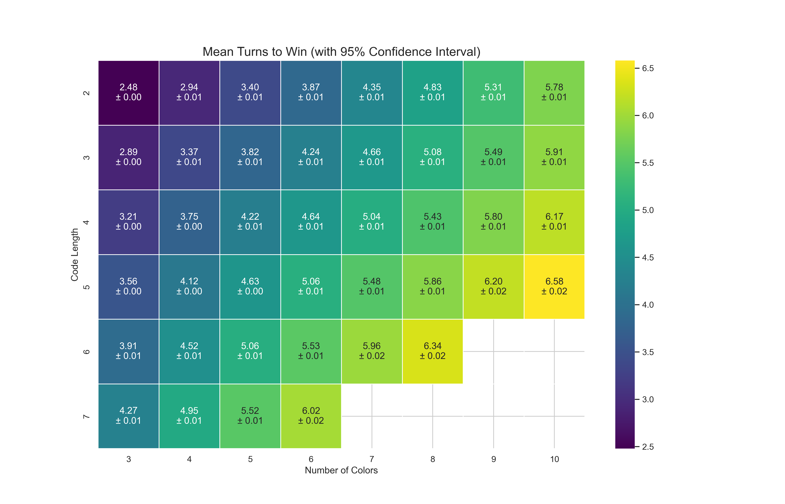
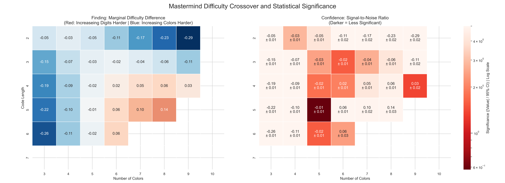

# Difficulty Analysis of Mastermind Game Variants

This analysis investigates how the classic game of Mastermind changes in difficulty as we alter two key game parameters: the number of available colors (`NumColors`), and the number of slots that make up the secret code (`CodeLength`). 

I built a custom Java Mastermind simulation and solver to simulate over 3.7 million games across 42 unique parameter sets to measure the solver's mean number of turns taken to win. Results reveal a non-linear crossover effect: in some regions, adding a new color adds more difficulty than increasing the code length, while in others, the opposite is true.

---

## Key Finding 1: The Difficulty Landscape

This project began as a pedagogical model for an AP Computer Science class and evolved into a data-logger capable of simulating millions of games to study its mechanics.

The heatmap below shows the mean turns to win (raw difficulty) for each game variant. The color represents the mean turns to win, and the annotations include the 95% confidence interval (e.g., `± 0.01`), confirming the high precision of the simulation. We can see the difficulty (brighter colors) increases as we move down (longer `CodeLength`) and as we move right (more `NumColors`).

*Mean turns to win for each (CodeLength, NumColors) variant, annotated with 95% confidence intervals.*

---

## Key Finding 2: Mapping the Crossover

This map raises a deeper question: Which parameter do we increment to add *more* difficulty? To answer this, I calculated the marginal difficulty of adding a digit versus adding a color. The figure below shows the complete answer.

* **The Left Plot (The Finding):** This map shows the *direction* of the difficulty difference. **Blue cells** show where adding a **color** is harder; **Red cells** show where adding a **digit** is harder.
* **The Right Plot (The Confidence):** This is the Statistical Significance Map. The color shows the signal-to-noise ratio (SNR) of the finding. **Darker cells** are *less* significant (the measured value is close to the uncertainty), while **lighter cells** are *highly* significant.

This side-by-side analysis confirms a clear, non-linear crossover boundary. As hypothesized, the boundary is pushed to the right for smaller code lengths, where the high "information gain" from adding a new digit continues to outweigh the larger search space.

Crucially, the significance map proves this is not a product of bad data. The low-significance (dark red) cells are the measured boundary *between* two highly significant, opposing effects (the blue and red regions).

---

## Technical Details

* **Simulation Engine:** The game logic [**(baseGame)**](Masrermind/src/baseGame/) and AI solver [**(ai)**](Masrermind/src/ai/) were written in **Java**. The solver uses a strategy of randomly selecting a guess from the universe of remaining valid codes. The [**(GUI)**](Masrermind/src/GUI/) uses Java's swing library. Download the [**latest release**](https://github.com/philMarcus/Mastermind/releases/download/v1.5/Mastermind.1.5.AI.Batches.jar) to play and use all features.
* **Data Generation:** The Java application was modified to run large numbers of simulated games and export the results to `.csv` files.
* **Analysis & Visualization:** A **Jupyter Notebook** was used for the analysis, with **Python** libraries **Pandas** for data manipulation and **Matplotlib/Seaborn** for all visualizations.

## Full Analysis

For the complete, step-by-step narrative of the analysis—including disproving the initial $C^L$ hypothesis and all data-wrangling code—please see the [**full Jupyter Notebook**](Mastermind/Mastermind_Analysis.ipynb).
